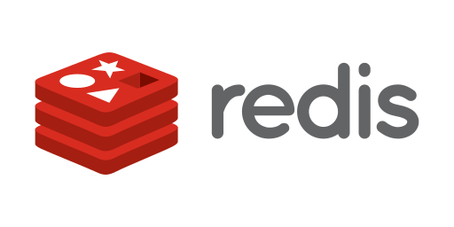

# 🛍️ Shopaholic Ecommerce Platform 🛒

Welcome to Shopaholic! 🎉 Your ultimate destination for fashion ecommerce. This state-of-the-art platform, powered by NestJS (Typescript) 🚀, brings you a curated selection of clothing items. With robust features like intuitive product search 🔍, secure payment processing through Stripe and MercadoPago 💳💰, and a collaborative filtering recommendation system 🤝, shopping here is a breeze.

Not only does Shopaholic cater to customers, but it also empowers administrators with an Angular-based backoffice 🖥️. Manage products, orders, and users effortlessly. The deployment is Dockerized for scalability 🐳, while a HaProxy load balancer ensures smooth traffic distribution 🔄.

Explore Shopaholic now for a modern, seamless, and delightful shopping experience! 😊👗👠

  
  
  
  
  
  
  
  
  
  
  
  
  
  
  

## Main Features

- 👗 **Fashion Product Catalog**: Explore a diverse collection of fashion products ranging from clothing to accessories.
- 🔍 **Product Search and Filtering**: Effortlessly find products using advanced search filters such as category, price range, size, color, and more.
- 🛒 **Shopping Cart and Checkout Process**: Enjoy a smooth shopping experience with the ability to add items to your cart and securely complete the checkout process.
- 💳 **Secure Payments with Stripe and MercadoPago**: Ensure peace of mind with secure payment processing through trusted payment gateways like Stripe and MercadoPago.
- 🛍️ **Personalized Product Recommendations**: Receive tailored product recommendations based on your browsing history and preferences, enhancing your shopping experience.
- 👤 **User Account Management**: Manage your account details, track order history, and update personal information effortlessly.
- 📱 **Social Media Integration**: Share your favorite products with friends and followers on popular social media platforms like Facebook, Twitter, and Instagram.
- 🖥️ **Administration Panel**: Empower administrators with a comprehensive panel to oversee and manage various aspects of the platform.

## BackEnd Development

Our robust BackEnd infrastructure powers the platform's functionality, ensuring smooth operations and seamless integration of features. Key highlights include:

- 🚀 **Scalable Architecture**: Built on a scalable architecture to accommodate growing user demands and evolving business needs.
- 🌐 **RESTful APIs**: Utilize RESTful APIs to facilitate communication between the FrontEnd and BackEnd, enabling seamless data exchange.
- 💾 **Database Management**: Employ efficient database management techniques to organize and store product, user, and order data securely.
- 💳 **Payment Gateway Integration**: Seamlessly integrate with Stripe and MercadoPago for secure and reliable payment processing, ensuring a hassle-free checkout experience.
- 🔒 **User Authentication and Authorization**: Implement robust user authentication and authorization mechanisms to safeguard user data and restrict access to sensitive information.
- 🛡️ **Data Security and Privacy**: Prioritize data security and privacy by adhering to industry best practices and compliance standards to protect user information.
- 🚀 **Performance Optimization**: Continuously optimize BackEnd performance to ensure fast response times and a seamless user experience.
- 🌐 **Clustered MariaDB Galera**: Leverage the power of clustered MariaDB Galera for high availability and fault tolerance, ensuring data consistency and reliability.
- 🔑 **Redis Cluster**: Utilize a Redis cluster for distributed caching and session management, improving performance and scalability.
- 📦 **MinIO Cluster**: Deploy a MinIO cluster for scalable object storage, enabling efficient handling of multimedia content and large files.

## Backoffice Administration

Our Angular-based backoffice provides administrators with powerful tools to efficiently manage the platform's operations. Key features include:

- 🔒 **Secure Administrator Login System**: Implement a secure login system with multi-factor authentication and role-based access control to protect sensitive administrative functionalities.
- 📊 **Comprehensive Product Management**: Admins can add, edit, and delete products from the catalog, manage inventory, and update product details effortlessly.
- 📦 **Efficient Order Processing**: Streamline order processing workflows by viewing, managing, and updating order statuses in real-time, ensuring timely fulfillment and delivery.
- 👥 **User Account Management**: Access detailed user profiles, handle account-related requests, and maintain user data integrity with ease.
- 🎨 **Intuitive Interface**: Design an intuitive and user-friendly interface with customizable dashboards and data visualization tools for easy navigation and efficient management tasks.

## Technologies Used

| Technology                  | Description                                                                 | Logo                                                                                   |
|----------------------------|-----------------------------------------------------------------------------|----------------------------------------------------------------------------------------|
| NestJS (Typescript)        | Backend framework for building scalable applications.                     |                                                         |
| MariaDB Galera Cluster     | High availability and replication relational database.                    |                                                           |
| Redis Cluster              | In-memory storage system for caching and session management.              |                                                        |
| Stripe                     | Online payment platform for transaction processing.                        |                                                        |
| MercadoPago                | Online payment and collections solution for ecommerce.                    |                                                     |
| MinIO Cluster              | High-performance object storage for handling media and assets.            |                                                        |
| Swagger Documentation     | Automatically generated API documentation using Swagger.                  |                                                          |
| HaProxy Load Balancer      | Load balancer for distributing traffic among backend services.             |                                                          |

## Technology Stack and Rationale 🛠️

### NestJS (Typescript) 🚀
NestJS was selected as the foundation of Shopaholic's backend due to its versatility, scalability, and robustness. With TypeScript support, NestJS ensures strong typing and enhanced tooling, leading to cleaner and more maintainable code. Its modular architecture facilitates seamless integration with other libraries and frameworks, making it an ideal choice for building sophisticated ecommerce applications like Shopaholic.

### MariaDB Galera Cluster 💿
MariaDB Galera Cluster was chosen as Shopaholic's relational database management system for its high availability and replication capabilities. The Galera Cluster ensures data consistency and redundancy, crucial for ecommerce platforms where data integrity is paramount.

### Redis Cluster 🔄
Redis Cluster is employed in Shopaholic for in-memory caching and session management, enhancing performance and scalability by reducing database load and response times.

### Stripe 💳
Stripe serves as Shopaholic's primary online payment platform, providing robust transaction processing capabilities and support for various payment methods to ensure secure and seamless transactions for customers.

### MercadoPago 💰
MercadoPago is integrated into Shopaholic to cater to customers preferring alternative payment methods. Its widespread adoption and popularity in Latin America make it an essential component for expanding Shopaholic's customer base.

### MinIO Cluster 📦
MinIO Cluster serves as Shopaholic's high-performance object storage solution, enabling efficient storage and retrieval of media and assets. Its distributed architecture and compatibility with S3 API make it ideal for handling large volumes of multimedia content.

### Angular 🅰️
Angular powers Shopaholic's admin backoffice, providing a robust and feature-rich frontend framework for managing products, orders, and users. Angular's component-based architecture and two-way data binding simplify development and maintenance tasks, ensuring a seamless user experience for administrators.

### Swagger Documentation 📖
Swagger Documentation is utilized in Shopaholic to automatically generate comprehensive API documentation, streamlining development, testing, and collaboration efforts.

### HaProxy Load Balancer 🔄
HaProxy Load Balancer is employed to distribute traffic evenly among backend services, ensuring high availability, fault tolerance, and scalability for Shopaholic, particularly during peak traffic periods.

### Backoffice Technologies Used

| Technology  | Description                                                                | Logo                                                                                   |
|-------------|----------------------------------------------------------------------------|----------------------------------------------------------------------------------------|
| Angular     | Frontend framework for creating dynamic user interfaces.                   |                |
| TypeScript  | Programming language for Angular application development.                  |                                                       |
| Akita   |  A Reactive State Management Tailored-Made for JS Applications          |                                                         |
| NG Zorro   | An enterprise-class Angular UI component library based on Ant Design, all components are open source and free to use under MIT license.           |                                                         |

## Docker Deployment

We offer Docker Compose-based deployment for easy scaling and management:

1. Clone the repository.
2. Navigate to the deployment folder using `cd deployment`.
3. Modify the configuration files as needed.
4. Run `docker-compose up -d` to deploy the services.

For detailed instructions on setting up and deploying using Docker, please check our [Docker Deployment Guide](link_to_docker_guide).

## Shopaholic Rake Tasks 🚀

Welcome to the Shopaholic Rake tasks section! Here you'll find a collection of tasks tailored to streamline the development and deployment processes of the Shopaholic platform.

### General Tasks

| Task                               | Description                                                                                               |
|------------------------------------|-----------------------------------------------------------------------------------------------------------|
| `shopaholic:login`                 | Authenticates with existing Docker credentials.                                                           |
| `shopaholic:cleaning_environment_task` | Cleans the Docker environment by removing unused images and volumes.                                       |
| `shopaholic:status`                | Displays the status of containers managed by Docker Compose.                                               |
| `shopaholic:deploy`                | Deploys the Shopaholic platform containers and launches all services and daemons needed for proper functioning. |
| `shopaholic:undeploy`              | Undeploys the Shopaholic platform containers.                                                             |
| `shopaholic:check_docker_task`     | Checks the availability and version of Docker and Docker Compose.                                           |

### MariaDB with Galera Cluster

| Task                                   | Description                                                                                      |
|----------------------------------------|--------------------------------------------------------------------------------------------------|
| `shopaholic:galera:start`              | Starts the highly available MariaDB with Galera Cluster and HAProxy containers.                  |
| `shopaholic:galera:stop`               | Stops the highly available MariaDB with Galera Cluster and HAProxy containers.                   |

### MinIO Cluster

| Task                                   | Description                                                                                      |
|----------------------------------------|--------------------------------------------------------------------------------------------------|
| `shopaholic:minio:start`               | Starts the MinIO cluster containers.                                                             |
| `shopaholic:minio:stop`                | Stops the MinIO cluster containers.                                                              |

### Redis Cluster

| Task                                   | Description                                                                                      |
|----------------------------------------|--------------------------------------------------------------------------------------------------|
| `shopaholic:redis:start`               | Starts the Redis cluster containers.                                                             |
| `shopaholic:redis:stop`                | Stops the Redis cluster containers.                                                              |

### Platform Backend

| Task                                   | Description                                                                                      |
|----------------------------------------|--------------------------------------------------------------------------------------------------|
| `shopaholic:platform:backend:start`    | Starts the Platform NodeJS containers for the backend.                                             |
| `shopaholic:platform:backend:stop`     | Stops the Platform NodeJS containers for the backend.                                              |
| `shopaholic:platform:backend:build`    | Builds the Docker image for the Platform NodeJS backend.                                            |
| `shopaholic:platform:backend:run_dev_server` | Runs the development server for the Platform NodeJS backend.                                    |

### Platform Backoffice

| Task                                   | Description                                                                                      |
|----------------------------------------|--------------------------------------------------------------------------------------------------|
| `shopaholic:platform:backoffice:start` | Starts the Platform NodeJS containers for the backoffice.                                           |
| `shopaholic:platform:backoffice:stop`  | Stops the Platform NodeJS containers for the backoffice.                                            |
| `shopaholic:platform:backoffice:build` | Builds the Docker image for the Platform backoffice.                                                |

### Utils Functions

- `show_docker_version`: Displays the version of Docker.
- `show_docker_compose_version`: Displays the version of Docker Compose.
- `which`: Finds an executable in the system's `$PATH`.

## Screenshots

Here are some screenshots showcasing the platform and backoffice:
